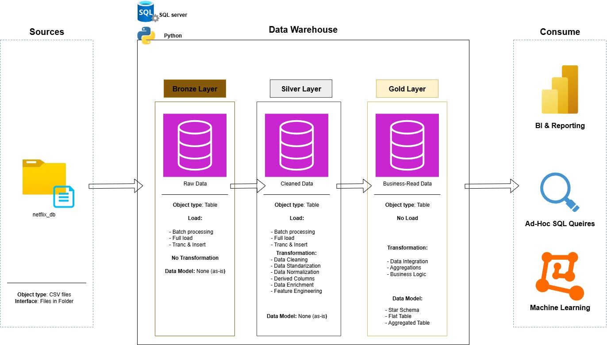
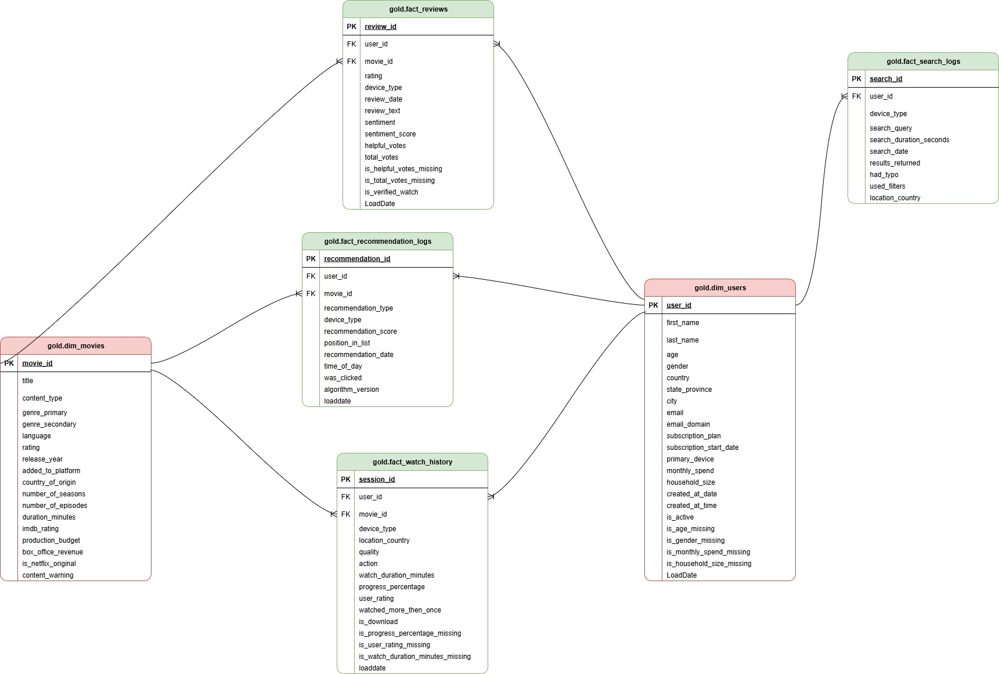

# 🎥 Netflix Data Warehouse & ML Readiness Project

## 🎯 Project Overview and Key Goals

This project implements a **comprehensive Data Warehouse (DWH)** based on Netflix movie data, user interaction logs, and reviews. The core objective was to establish a scalable, three-tiered **Medallion Architecture** , prepared to feed both Business Intelligence (OLAP) analytics and Machine Learning models.

### Key Technical Challenges Solved:

1.  **ETL/ELT Transformation:** Migrating data from raw CSVs into an optimized **Star Schema**.
2.  **Data Quality (DQ):** Implementing advanced data cleansing, contextual imputation (median for ratings, zero for budgets), and generating `is_missing` flags for ML readiness.
3.  **DWH Optimization:** Designing and implementing an indexing strategy (Clustered/Non-Clustered) in TSQL to optimize critical JOIN operations within the Silver Layer.
4.  **Data Modeling:** Creating a **Fact Constellation** model (multiple fact tables sharing common dimensions) in the Gold Layer.

---

## 🏗️ Medallion Architecture and Data Flow

Data in the project moves through three defined layers:
 
| Layer | SQL Schema Name | Tools / Logic | Purpose |
| :--- | :--- | :--- | :--- |
| **BRONZE** | `bronze` | TSQL `BULK INSERT` | Raw, immutable data. The starting point. |
| **SILVER** | `silver` | **Python (Pandas)**, TSQL `UPDATE`/`JOIN` | Cleansing, Imputation, Type Conversion (e.g., `BOOL` to `BIT/INT`), Feature Engineering (`is_missing` flags). **Source for ML.** |
| **GOLD** | `gold` | TSQL DDL/DML, JOIN | Optimized **Star Schema** (Fact / Dim). **Source for Power BI/Analytics.** |

---

## ⚙️ Technology Stack

| Category | Tools / Languages | Role in Project |
| :--- | :--- | :--- |
| **Data Engineering** | Python (Pandas/NumPy) | ETL/ELT Transformation, Imputation, and Data Validation. |
| **Database** | MS SQL Server (TSQL) | DWH Modeling, Indexing, Schema Management. |
| **Data Modeling** | Star Schema (Fact Constellation) | Optimizing OLAP queries (BI). |
| **Version Control** | Git / GitHub | Code management and professional organization. |
| **Future Scalability** | BigQuery / AWS Glue / PySpark | Planned migration to a Serverless Data Lakehouse. |

---

## 📂 Catalog Structure and Code Organization

The repository is logically organized to reflect the data lifecycle in a Data Engineering project.

Rozumiem, Maćku, i dziękuję za informację zwrotną! To, że struktura "zlewa się w kupę" i nie ma drzewa, oznacza, że domyślne symbole używane do rysowania linii (ASCII/Unicode) są ignorowane.

Jest tylko jedna pewna metoda, aby to naprawić na GitHubie: użyć czystych spacji i wcięcia na bloku kodu, ale z uproszczonymi symbolami, które są kompatybilne z większością renderów Markdown.

Wyślij mi ten sam blok kodu w ten sposób (zobacz, jak użyłem prostszych myślników i strzałek, a nie skomplikowanych symboli ├── i └──):

## 📂 Catalog Structure and Code Organization

The repository is logically organized to reflect the data lifecycle in a Data Engineering project.
- README.md
- TODO.md
- databases
  - bronze
    - logs_recom.csv
    - movies.csv
    - reviews.csv
    - search_logs.csv
    - users.csv
    - watch_history.csv
  - gold
    - placeholder
  - placeholder
  - silver
    - netflix_silver_layer_logs.csv
    - netflix_silver_layer_movies.csv
    - netflix_silver_layer_search_logs.csv
    - netflix_silver_layer_users.csv
    - netflix_silver_layer_watch_history.csv
    - placeholder
- documents
  - DWH_plan.jpg
  - DataModel.drawio
  - DataModel.jpg
  - dwh_plan.drawio
  - placeholder
- issues
  - error_handling_reviews.sql
  - error_log_reviews.txt
  - file_repairing_watchhistory.py
  - placeholder
- requirements.txt
- scripts
  - bronze
    - DDL_bronze_movies.sql
    - DDL_bronze_recommendation_logs.sql
    - DDL_bronze_reviews.sql
    - DDL_bronze_reviews_numeric.sql
    - DDL_bronze_reviews_string.sql
    - DDL_bronze_search_logs.sql
    - DDL_bronze_users.sql
    - DDL_bronze_watch_history.sql
    - load_bronze_reviews_numeric.sql
    - load_bronze_reviews_string.sql
    - load_bronze_watchhistory.sql
  - gold
    - DDL_gold_movies.sql
    - DDL_gold_recommendation_log.sql
    - DDL_gold_reviews.sql
    - DDL_gold_searchlogs.sql
    - DDL_gold_users.sql
    - DDL_gold_watch_history.sql
    - NC_gold_indexs.sql
    - load_gold_movies.sql
    - load_gold_recommendation_logs.sql
    - load_gold_reviews.sql
    - load_gold_searchlogs.sql
    - load_gold_users.sql
    - load_gold_watch_history.sql
  - index_user_id_duration.sql
  - silver
    - DDL_silver_logs_recommendation.sql
    - DDL_silver_movies.sql
    - DDL_silver_reviews.sql
    - DDL_silver_search_logs.sql
    - DDL_silver_users.sql
    - DDL_silver_watch_history.sql
    - load_silver_logs_recommendation.sql
    - load_silver_movies.sql
    - load_silver_reviews.sql
    - load_silver_search_logs.sql
    - load_silver_users.sql
    - load_silver_watch_history.sql
    - python_cleaning
    - reusable_funcs.py
- tests
  - review_numeric.sql
  - review_strings.sql
## Data Relations
 
## 📖 Data Dictionary

The complete documentation for every column, its data type, and business purpose can be found in the file: **`data_catalog.md`**
